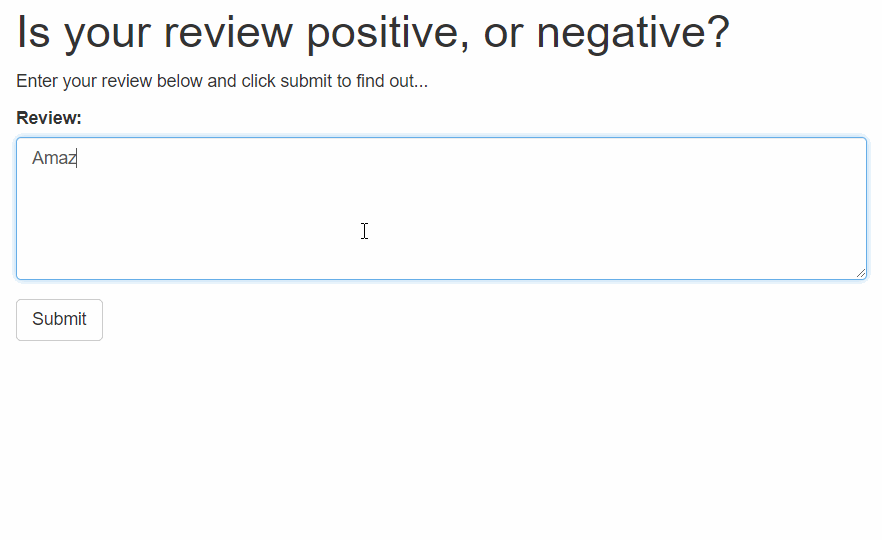

## Deep Learning Nanodegree - Udacity
### SageMaker Deployment Project


This is the final solution of the project 'Sagemaker Deployment' which consists in deploying a Sentiment Analysis model using RNN in the Amazon AWS SageMaker tool (The architecture consists of AWS API Gateway and AWS Lambda function as well). The notebook and Python files provided here result in a simple web app which interacts with a deployed recurrent neural network performing sentiment analysis on movie reviews.  

You can find the original code without solutions in the original [Udacity SageMaker Deployment repository](https://github.com/udacity/sagemaker-deployment).

## Setup instructions
Please see the [original README](https://github.com/udacity/sagemaker-deployment/tree/master/README.md) in the root directory for instructions on setting up a SageMaker notebook and downloading the project files (as well as the other notebooks). For the solutions only clone this repository:

```
cd SageMaker
git clone https://github.com/hjlopes/sagemaker-sentiment-analysis
exit
```

## Web app final result

The final project will be executed in a simple html page which can be deployed anywhere. 

You will see the following:

 
